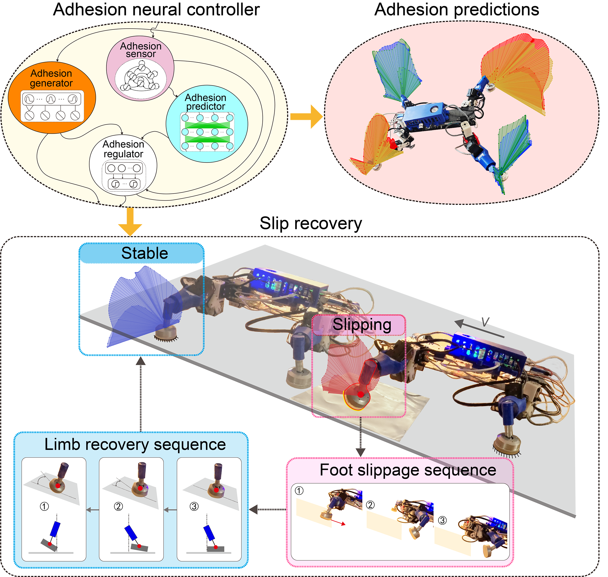

# Adhesion nerual controller for gecko-inspired robot 

## Overview

This project introduces a neural adhesion controller to improve the stability of gecko‐inspired climbing robots. By integrating an echo state network and a multilayer perceptron, the system utilizes joint torque feedback to accurately estimate adhesion in both normal and shear directions and predict slips. This enables effective recovery from slip events, ensuring robust locomotion on challenging, low‐adhesion terrains.



## Project Structure

```
Nyxbot adhesion controller/
├── Model/                  # Neural network models
│   ├── cpg.py             # Central Pattern Generator implementation
│   ├── esn.py             # Echo State Network model
│   ├── mlp.py             # Multi-Layer Perceptron model
│   ├── rbf.py             # Radial Basis Function model
│   └── LearnedModel/      # Saved trained models
├── training/              # Training scripts
│   ├── esn_train.py       # ESN training with PSO optimization
│   └── mlp_train.py       # MLP training pipeline
└── Scripts/               # Utility scripts
    ├── DataHandle.py      # Data preprocessing and handling
    └── filehandle.py      # File I/O operations


## Key Features

### 1. Echo State Network (ESN) Implementation
- **Reservoir Computing**: Implements ESN with configurable reservoir size, spectral radius, sparsity, and leak rate
- **PSO Optimization**: Uses Particle Swarm Optimization to find optimal hyperparameters
- **Multi-limb Support**: Separate models for each limb (RF, LF, LH, RH - Right Front, Left Front, Left Hind, Right Hind)
- **Ground Reaction Adhesion Prediction**: Predicts GRA in Y and Z directions

### 2. Multi-Layer Perceptron (MLP)
- **Prediction Network**: Complements ESN for improved accuracy
- **PyTorch Implementation**: Flexible neural network with configurable layers
- **Model Loading**: Utilities for loading pre-trained models by limb and axis

### 3. Central Pattern Generator (CPG)
- **Biomimetic Control**: Generates rhythmic patterns similar to biological neural circuits
- **Adaptive Parameters**: Time-varying frequency control through `MI`
- **2D Output**: Generates coordinated oscillations for locomotion control


## Installation

### Prerequisites
```bash
pip install numpy
pip install scikit-learn
pip install torch
pip install pyswarms
pip install matplotlib
pip install joblib
```

### Setup
1. Clone the repository
2. Ensure Python 3.7+ is installed
3. Install required dependencies
4. Place training data in `DataForTrain/` directory

## Usage
### Data Preprocessing
```python
from Scripts.DataHandle import normalize_data, get_sample_ids, generate_data_sets

# Load and normalize data
"""
    Data format requirements for training:
    
    The data_for_train.npy file should contain a 2D array with 40 columns where:
    
    - Joint Positions (columns 0-16):
        RF (Right Front): columns 0-4
        LF (Left Front):  columns 4-8
        LH (Left Hind):   columns 8-12
        RH (Right Hind):  columns 12-16
    
    - Joint Torques (columns 16-32):
        RF (Right Front): columns 16-20
        LF (Left Front):  columns 20-24
        LH (Left Hind):   columns 24-28
        RH (Right Hind):  columns 28-32
    
    - Ground Reaction Forces - GRFs (columns 32-40):
        RF (Right Front): columns 32-34
        LF (Left Front):  columns 34-36
        LH (Left Hind):   columns 36-38
        RH (Right Hind):  columns 38-40
 """
# Replace data_path with your own data file path following the format specified above
data = np.load('data_for_train.npy')
normalized_data = normalize_data(data, save_scaler='./Model/')

# Generate train/val/test splits
sample_ids = get_sample_ids()
train_set, val_set, test_set = generate_data_sets(sample_ids, normalized_data)
```

### Training ESN Models
```python
from training.esn_train import esn_train

# Train ESN for a specific limb
data_path = './DataForTrain/data_for_train.npy'
optimal_params = esn_train(data_path, 'RH')  # Train for Right Hind limb
```

### Loading Pre-trained Models
```python
from Model.esn import load_esn_models
from Model.mlp import load_named_models, MLP

# Load ESN models for all limbs
rf_esn, lf_esn, lh_esn, rh_esn = load_esn_models()

# Load MLP models
model_tags = ["RF_Z", "RF_Y", "LF_Z", "LF_Y", "LH_Z", "LH_Y", "RH_Z", "RH_Y"]
mlp_models = load_named_models(MLP, model_tags, "./Model/LearnedModel/")
```


## Model Architecture

### Echo State Network
- **Input Size**: 4 (joint angles or sensor readings per limb)
- **Reservoir Size**: Optimized via PSO (typically 10-160 neurons)
- **Output Size**: 2 (GRF_Y, GRF_Z)
- **Activation**: Tanh activation function
- **Training**: Ridge regression for output weights

### Multi-Layer Perceptron
- **Input Size**: 70 (half-period of motion data)
- **Hidden Layers**: 2 layers with 32 neurons each
- **Output Size**: 70 (prediction for second half of period)
- **Activation**: ReLU activation


## Training Process

1. **Data Preparation**: Load, normalize, and split data
2. **ESN Training**: Find optimal ESN hyperparameters
3. **MLP Training**: Find optimal MLP hyperparameters
4. **Validation**: Evaluate on validation set
5. **Model Saving**: Save trained models for deployment


## Applications

- **Adhesive locomotion Control**: Real-time adhesive locomotion control
- **Force Prediction**: Ground reaction Adhesion estimation


